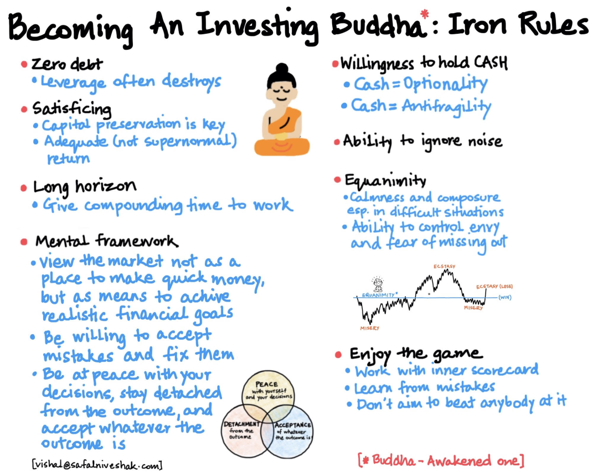

# 还债

## 债务 

| 名称      | 进度 |
| ----------- | ----------- |
| 亲戚      | 8/30       |
| hy   | 0/10        |
| fw   | 0/10        |

## 收入

- 工资
- 副业
- 其他

## 支出预算

- 年 20

## 投资

 
- [ 跌到绝望、涨到癫狂｜财务自由实证 #66 ](https://mp.weixin.qq.com/s?__biz=MzUzNjE3NzQ3Nw==&mid=2247493496&idx=1&sn=45fb81ad80491d29e5d7f32e9df04149&chksm=faf89952cd8f10445093240e2329e9ce88e0e75b26fae5a65d788992ff26758451c2de521772&cur_album_id=1319255999014043648&scene=189#wechat_redirect)